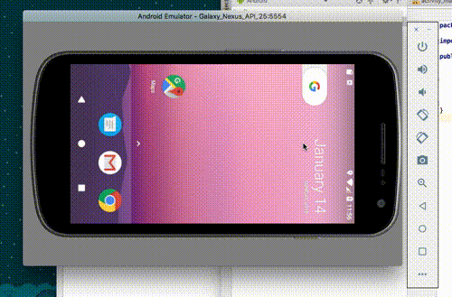
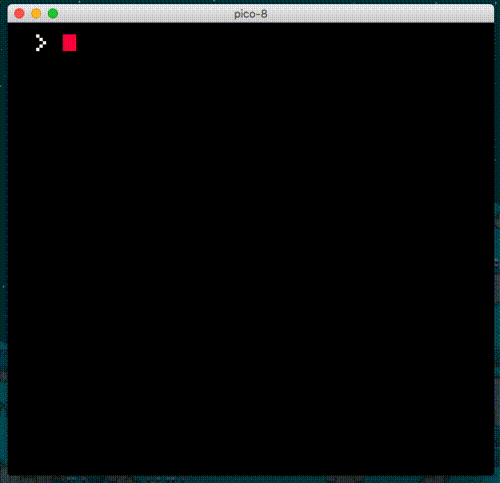

# Pico Deploy
*Deploy Pico-8 Games Anywhere and Everywhere!*




**Example .gifs show the jelpi demo cart. Included cart is different.**

# Table Of Contents

* [Features](#features)
* [Getting Started](#getting-started)
* [Key Gotchas and Caveats](#compatibility)
* [Keyboard Controls](#getting-started)
* [Project Layout](#compatibility)
* [Usage](#Usage)
* [Example Projects](#compatibility)
* [Building and Deploying for Web](#getting-started)
* [Building and Deploying for Desktop](#getting-started)
* [Building and Deploying for Android](#getting-started)
* [Building and Deploying for iOS](#getting-started)
* [Adding support for other platforms](#compatibility)
* [Parent Projects and Dependencies](#additional-info)
* [Contributing](#contributing)
* [LICENSE](#license)

# Features

* 🖥️ Deploy to Windows, Mac, and Linux using [Electron](https://electronjs.org/) and [Electron Builder](https://github.com/electron-userland/electron-builder)
* 📱 Deploy to Android, iOS, and Web with all listed features using [Ionic](https://ionicframework.com/)
* 💾 Save file (Indexedb) listener, with Pub / Sub functionality to perform actions when the save file is changed
* 🎮 Mobile on screen gamepad using [Google Material Icons](https://material.io/icons/)
* 🎮 Usb Gamepad / Xbox 360 controller / PS3 controller support using a modified [pico8gamepad](https://github.com/krajzeg/pico8gamepad)
* 💦 Splashscreen / Video to hide the Pico 8 boot screen (Not to be mistaken with Ionic mobile app splash screen)
* 📺 Background image or video to be displayed behind your game
* ⚙️ Settings screen, with support for turning sound on / off, fullscreen for desktop, customizable gamepad color, customizable background color (if not background media), Stretch the game to full resolution, and dropdown credits.
* 🛠️ Build System to support multiple `picoDeployConfig.json` files, and copied for the correct build target set in ENV variables.
* ♻️ Compatible with libraries like [greenworks](https://github.com/greenheartgames/greenworks) and [Cordova Plugin Play Games Services](https://github.com/artberri/cordova-plugin-play-games-services). That can be plugged into a commented PlatformSdkWrapper service, which taps into the Save file listener I mentioned above

P.S I totally started this project before [version 0.1.11](https://www.lexaloffle.com/bbs/?tid=30219) which included binary exports for Windows, Mac, and Linux. However, this project still offers a great amount of functionality for deploying and building games, that binary exports do not offer currently.

# Getting Started

1. Install [Nodejs](https://nodejs.org/en/download/package-manager/). I suggest using [NVM](https://github.com/creationix/nvm).

2. Download this project as a zip, or fork it. This is a base project that yours project will be based upon.

2. Run `npm install` in the base directory of the project

3. Run `npm run ionic:serve`. And open [localhost:8100](http://localhost:8100) if it does not open it for you.

4. If a game starts running in your browser, then you are ready to go. Enjoy! 😊

# Key Gotchas and Caveats

* Minimum android version is 7.1.1 (sdk version 25). This is due to the [Web Audio API](https://caniuse.com/#feat=audio-api) and how around Android version 7, [android replaced their webview with Mobile Chrome](https://developer.android.com/about/versions/nougat/android-7.0.html#webview). Games can technically be played on Android versions below this, but there will be a weird [Audio Jitter / Crackle](https://www.lexaloffle.com/bbs/?tid=30573). Please feel free to click the previous link to join the discussion, or open an issue if you feel you may have a solution.

* Adding support for Steamworks using [greenworks](https://github.com/greenheartgames/greenworks) will have many missing steam features, and can be quite finnicky. For instance, the Steam UI cannot be opened, even with mentioned hacks within the projects issues. However, most functionality such as logging into steam, and launching achievements should work.

# Keyboard Controls


[Image from pico8-api](https://neko250.github.io/pico8-api/)

Additional Key commands are:

* `o` for settings (options)
* `p` for pause

# Project Layout

* `cart/` - Where `cart.js` files are stored.
* `config/` - Where `picoDeployConfig.whatever.json` files are placed, and the `copyConfig.js` file lives to copy `picoDeployConfig.json` to the base of the project to be used by the application.
* `resources/` - Where app icons for Electron Builder and Ionic are stored
* `src/` - Where the source code for the Ionic application lives.
* `src/app` - The main app component
* `src/assets` - Where asstets for the application lives. Please take note of `src/assets/picomedia` where the splashscreen and things are stored
* `src/components` - Where The application components are stored. Such as the cart, and gamepad components
* `src/pages` - Where the Home and Settings page components are stored
* `src/providers` - Where the services are stored. Such as the Save file listener provider, and the Settings provider.
* `config.xml` - Ionic / Cordova Config for building the application
* `ionic-android-deploy.sh` - Script for easing the proccess of building signed android apks to upload to the Google Play Store.
* `main.js` - Electron Main process Javascript file. See [Electron Quick Start](https://github.com/electron/electron/blob/master/docs/tutorial/quick-start.md)
* `package.json` - Project file to define scripts and dependencies

# Usage

### To add your own cart(s):

1. open pico-8
2. load your cart
3. export your cart with `CART_NAME.html`

Or just watch these steps in the gif below:



4. Copy the `.js` file that was export into `picoDeploy/cart`.
5. edit the `picoDeployConfig.json` file to include your cart instead of the included one.
6. Run `npm run ionic:serve`, and ensure that your cart is now the one being loaded!

### Npm Scripts / CLI

All of the scripts should be prepended with `npm run [script name]`, for instance `npm run ionic:serve`

The main scripts you will be using are the `ionic:x`, `electron:x`, and `android:x` scripts.

The android scripts will require you to set up your android environment, outlined in [Building and Deploying for Android](#getting-started)

* `clean` - The default ionic project clean script
* `lint` - The default ionic project lint script
* `cart` - copies to the files within the  `cart/` folder to the built `www/cart` folder
* `config` - runs the `copyConfig.js` script, to copy the appropriate `picoDeployConfig.json` according to the ENV variables
* `build` - runs the default ionic project build script
* `serve` - runs the default ionic project build script
* `ionic:build` - runs the `cart`, `config`, and `build` scripts to build the complete picoDeploy app
* `ionic:serve` - runs the `cart`, `config`, and `build` scripts to serve / livereload the complete picoDeploy app for development
* `android:run` - exports Mobile ENV Variables, runs `cart`, and `config`, and then runs `ionic cordova run android --prod` to preview a build of the app on a connected android device, or android emulator
* `android:serve` - Same functionality as `ionic:serve`, but runs on an android device like `android:run`
* `android:build` - Similar to `android:run`, but builds an unsigned apk to be distributed.
* `android:deploy` - similar to `android:build`, but uses (and requires) a keystore to zipalign and sign built apks, by running the `ionic-android-deplpoy.sh` script
* `electron:serve` - Runs `ionic:build`, and runs the built files inside an electron container
* `electron:serve:nobuild` - Similar to `electron:serve`, but does not re-build the app. This is useful to testing changes on only the `main.js` file
* `electron:build` - Builds the application using [Electron Builder](https://github.com/electron-userland/electron-builder) for the current Operating system. This is useful for testing final production builds.
* `electron:deploy` - Similar to `electron:build`, but builds for all desktop platforms (Windows, Mac, and Linux), using the Electron builder configuration outlined in the `package.json`


### picoDeployConfig.json

Inlined the json file with improper comment files to describe each key

```
{
  "cart": {
    "cartName": "getdismoney-communitty.js" // Name or path of the cart inside the cart/ directory
  },
  "picosplash": { // Settings reffering to the introduction splash screen that hides pico-8 booting
    "enable": true, // Boolean to enable or disable the pico splash
    "splashMedia": "assets/picomedia/splash.mp4" // HTML5 compliant image or video file to be displayed over the cart booting
  },
  "backgroundMedia": false, // HTML5 compliant image or video file to be displayed behind the cart. Set to false to disable
  "inactiveToExitDelayInMilli": 300000, // How long before killing the app if left in the background
  "defaultSettings": { // Default settings to set on the settings menu
    "fullscreen": true, // Start the app in full screen or not by default
    "sound": true, // Enable or disable sound by default
    "backgroundColor": "#272727", // backgroundColor displayed behind cart if no backgroundMedia
    "gamepadColor": "#FFFFFF", // Default color of the gamepad
    "stretch": false // Default to stretching the game to match the aspect ratio
  },
  "dbWatcher": { // Save file watcher config
    "enable": true, // Boolean to enable or disable the save file (Indexedb) watcher
    "cartDataName": "nocomplygames_letsgetdismoney_communitty_edition_v1" // String passed to cartdata() to be found in the Indexedb
  }
}
```

# Contributing

Feel free to fork the project, open up a PR, and give any contributions! I'd suggest opening an issue first however, just so everyone is aware and can discuss the proposed changes.

# LICENSE

LICENSE under [Apache 2.0](https://choosealicense.com/licenses/apache-2.0/)

# Notes

Using Electron and [Electron Builder](https://github.com/electron-userland/electron-builder). Simply Follow the quick setup guide for electron builder for help.

Play with the config.xml: https://cordova.apache.org/docs/en/latest/config_ref/

Plugins can have settings in config.xml, splashscreen editing: https://cordova.apache.org/docs/en/latest/reference/cordova-plugin-splashscreen/

May only need the cart.js. Convert the Cart.html into an angular component and be chilling. And be sure to include the cart.js in index.html

Deploying with Ionic: https://ionicframework.com/docs/intro/deploying/

Generating Resources and icons: https://ionicframework.com/docs/cli/cordova/resources/

crosswalk for performance: https://www.techiediaries.com/mobiledev/boosting-ionic2-apps-performance-with-crosswalk/

Using Greenworks: https://github.com/greenheartgames/greenworks

Install Greenworks with: https://github.com/greenheartgames/greenworks/blob/master/docs/build-instructions-electron.md#building-with-electron-rebuild and skip to step 4

Also will require steamworks sdk: https://github.com/greenheartgames/greenworks/blob/master/docs/get-steamworks-sdk.md

May need to manually add releases for each distro greenworks for electron .node files to `node_modules/greenworks/lib`

doign some funny stuff with the files key for electron builder to keep our build size small, and not include node modules, since they are included with the vendor on ionic.

may actually want to follow the NW.js for greenworks. NW.js is just a browserify/webpack thing that used to exist. Which we will have due to electron and all that

see how I am copy steam_app id for builds and stuff in main.js. and follow greenworks directory structure.

32 bit linux for steam not supported because names are same in [this guide](https://github.com/greenheartgames/greenworks/blob/master/docs/quick-start-nwjs.md)

Must Use Correct [electron](https://github.com/electron/electron/releases/tag/v1.8.1) AND [node](https://github.com/electron/electron/blob/04430c6dda80c25d24b7752f38f87003ac7ab3aa/.node-version) version, and then [do some cleanup](https://stackoverflow.com/questions/19996312/should-i-backup-the-npm-and-node-gyp-folder), or else will get a NODE_MODULE_VERSION (which Electron has its own compared to NOde :p), if going to use  [prebuilt .node addons for greenworks](https://github.com/greenheartgames/greenworks/releases/tag/v0.11.0).

Linux AppIMage doesn't work for greenworks testing because [appImage directory is read-only](https://github.com/AppImage/AppImages/issues/80), thus we can't copy over the steam appId.

Used this for google play games: https://github.com/artberri/cordova-plugin-play-games-services

NOTE: Will only work if installed from google play store after you have it built. So will have a long testing process :p Currently have it installed under aaron@aaronthedev

Maybe? Used this to add neccessary android manifest stuff: https://cordova.apache.org/docs/en/latest/plugin_ref/spec.html#edit-config

may need to this to build for all: https://github.com/electron-userland/electron-builder/issues/2204
Also, need to make sure we have `resources/icons/` folder, with an app icon named `512x512.png` [for linux icon](https://www.electron.build/icons)

May need to install gradle https://github.com/ionic-team/ionic/issues/11591

Cross walk docs: https://github.com/crosswalk-project/cordova-plugin-crosswalk-webview

need android 6.3  
```
cordova platform add android@6.3.0
```
