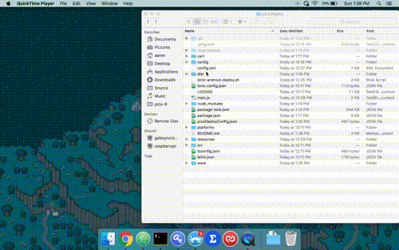

# Pico Deploy
*Deploy Pico-8 Games Anywhere and Everywhere!*




**Example .gifs show the jelpi demo cart. Included cart is different.**

# Table Of Contents

* [Features](#features)
* [Getting Started](#getting-started)
* [Key Gotchas and Caveats](#compatibility)
* [Keyboard Controls](#getting-started)
* [Project Layout](#compatibility)
* [Example Projects](#compatibility)
* [Building and Deploying for Web](#getting-started)
* [Building and Deploying for Desktop](#getting-started)
* [Building and Deploying for Android](#getting-started)
* [Building and Deploying for iOS](#getting-started)
* [Adding support for other platforms](#compatibility)
* [Parent Projects and Dependencies](#additional-info)
* [Contributing](#contributing)
* [LICENSE](#license)

# Features

* Deploy to Windows, Mac, and Linux using [Electron](https://electronjs.org/) and [Electron Builder](https://github.com/electron-userland/electron-builder)
* Deploy to Android, iOS, and Web with all listed features using [Ionic](https://ionicframework.com/)
* Save file (Indexedb) listener, with Pub / Sub functionality to perform actions when the save file is changed
* Mobile on screen gamepad using [Google Material Icons](https://material.io/icons/)
* Usb Gamepad / Xbox 360 controller / PS3 controller support using a modified [pico8gamepad](https://github.com/krajzeg/pico8gamepad)
* Splashscreen / Video to hide the Pico 8 boot screen (Not to be mistaken with Ionic mobile app splash screen)
* Background image or video to be displayed behind your game
* Settings screen, with support for turning sound on / off, fullscreen for desktop, customizable gamepad color, customizable background color (if not background media), Stretch the game to full resolution, and dropdown credits.
* Build System to support multiple `picoDeployConfig` files, and copied for the correct build target set in ENV variables.
* Compatible with libraries like [greenworks](https://github.com/greenheartgames/greenworks) and [Cordova Plugin Play Games Services](https://github.com/artberri/cordova-plugin-play-games-services). That can be plugged into a commented PlatformSdkWrapper service.

P.S I totally started this project before [version 0.1.11](https://www.lexaloffle.com/bbs/?tid=30219) which included binary exports for Windows, Mac, and Linux. However, this project still offers a great amount of functionality for deploying and building games, that binary exports do not offer currently.

# Key Gotchas and Caveats

* Minimum android version is 7.1.1 (sdk version 25). This is due to the [Web Audio API](https://caniuse.com/#feat=audio-api) and how around Android version 7, [android replaced their webview with Mobile Chrome](https://developer.android.com/about/versions/nougat/android-7.0.html#webview). Games can technically be played on Android versions below this, but there will be a weird [Audio Jitter / Crackle](https://www.lexaloffle.com/bbs/?tid=30573). Please feel free to click the previous link to join the discussion, or open an issue if you feel you may have a solution.

* Adding support for Steamworks using [greenworks](https://github.com/greenheartgames/greenworks) will have many missing steam features, and can be quite finnicky. For instance, the Steam UI cannot be opened, even with mentioned hacks within the projects issues. However, most functionality such as logging into steam, and launching achievements should work.

# Notes

Using Electron and [Electron Builder](https://github.com/electron-userland/electron-builder). Simply Follow the quick setup guide for electron builder for help.

Play with the config.xml: https://cordova.apache.org/docs/en/latest/config_ref/

Plugins can have settings in config.xml, splashscreen editing: https://cordova.apache.org/docs/en/latest/reference/cordova-plugin-splashscreen/

May only need the cart.js. Convert the Cart.html into an angular component and be chilling. And be sure to include the cart.js in index.html

Deploying with Ionic: https://ionicframework.com/docs/intro/deploying/

Generating Resources and icons: https://ionicframework.com/docs/cli/cordova/resources/

crosswalk for performance: https://www.techiediaries.com/mobiledev/boosting-ionic2-apps-performance-with-crosswalk/

Using Greenworks: https://github.com/greenheartgames/greenworks

Install Greenworks with: https://github.com/greenheartgames/greenworks/blob/master/docs/build-instructions-electron.md#building-with-electron-rebuild and skip to step 4

Also will require steamworks sdk: https://github.com/greenheartgames/greenworks/blob/master/docs/get-steamworks-sdk.md

May need to manually add releases for each distro greenworks for electron .node files to `node_modules/greenworks/lib`

doign some funny stuff with the files key for electron builder to keep our build size small, and not include node modules, since they are included with the vendor on ionic.

may actually want to follow the NW.js for greenworks. NW.js is just a browserify/webpack thing that used to exist. Which we will have due to electron and all that

see how I am copy steam_app id for builds and stuff in main.js. and follow greenworks directory structure.

32 bit linux for steam not supported because names are same in [this guide](https://github.com/greenheartgames/greenworks/blob/master/docs/quick-start-nwjs.md)

Must Use Correct [electron](https://github.com/electron/electron/releases/tag/v1.8.1) AND [node](https://github.com/electron/electron/blob/04430c6dda80c25d24b7752f38f87003ac7ab3aa/.node-version) version, and then [do some cleanup](https://stackoverflow.com/questions/19996312/should-i-backup-the-npm-and-node-gyp-folder), or else will get a NODE_MODULE_VERSION (which Electron has its own compared to NOde :p), if going to use  [prebuilt .node addons for greenworks](https://github.com/greenheartgames/greenworks/releases/tag/v0.11.0).

Linux AppIMage doesn't work for greenworks testing because [appImage directory is read-only](https://github.com/AppImage/AppImages/issues/80), thus we can't copy over the steam appId.

Used this for google play games: https://github.com/artberri/cordova-plugin-play-games-services

NOTE: Will only work if installed from google play store after you have it built. So will have a long testing process :p Currently have it installed under aaron@aaronthedev

Maybe? Used this to add neccessary android manifest stuff: https://cordova.apache.org/docs/en/latest/plugin_ref/spec.html#edit-config

may need to this to build for all: https://github.com/electron-userland/electron-builder/issues/2204
Also, need to make sure we have `resources/icons/` folder, with an app icon named `512x512.png` [for linux icon](https://www.electron.build/icons)

May need to install gradle https://github.com/ionic-team/ionic/issues/11591

Cross walk docs: https://github.com/crosswalk-project/cordova-plugin-crosswalk-webview

need android 6.3  
```
cordova platform add android@6.3.0
```


This is a starter template for [Ionic](http://ionicframework.com/docs/) projects.

## How to use this template

*This template does not work on its own*. The shared files for each starter are found in the [ionic2-app-base repo](https://github.com/ionic-team/ionic2-app-base).

To use this template, either create a new ionic project using the ionic node.js utility, or copy the files from this repository into the [Starter App Base](https://github.com/ionic-team/ionic2-app-base).

### With the Ionic CLI:

Take the name after `ionic2-starter-`, and that is the name of the template to be used when using the `ionic start` command below:

```bash
$ sudo npm install -g ionic cordova
$ ionic start myBlank blank
```

Then, to run it, cd into `myBlank` and run:

```bash
$ ionic cordova platform add ios
$ ionic cordova run ios
```

Substitute ios for android if not on a Mac.
